# Stein's Shrinkage Estimator: Impact Analysis in Physical Education Studies

## Overview

This project explores Stein's shrinkage estimators in the context of parallel experiments, specifically examining the effect of additional physical education hours on children's Body Mass Index (BMI).

## Problem Statement

We investigate whether increasing physical education by 4 hours can affect children's BMI, offering a potential solution to childhood obesity.

### Experimental Setup

- Multiple parallel experiments measuring treatment effects
- Each experiment represents a different class of students
- Statistical analysis comparing estimation methods

## Statistical Framework

- Random variable $Y_{i}$ represents treatment effect in experiment $i$
- $Y_{i}$ follows Normal distribution: $Y_{i}\sim N\ (\mu_{i},\ \ \sigma^{2})$
- Objective: Find the most efficient estimator with smallest Mean Squared Error (MSE)

## Estimation Methods

### 1. Traditional Approach: Sample Mean

- Computed as: $\overline{Y} = \frac{\sum_{}^{}Y_{i}}{n}$
- Properties: Unbiased, consistent
- $MSE = \sigma^{2}/n$

### 2. James-Stein Estimator

- Shrinkage estimator for parallel experiments ($p \geq 3$)
- Shrinking factor: $c = \max\{ 0,1 - \frac{(p - 2)*\sigma^{2}}{n\sum_{}^{}{\overline{Y}}^{2}}\}$
- Estimate: $\mu_{JS} = c*\overline{Y}$
- Properties: Biased but often more efficient

## Methodology

1. Simulation of parallel experiments with known parameters
2. Calculation of MSE for both estimators
3. Performance analysis across varying experiment numbers

### Simulation Cases

We explored six different parameter configurations:

| Case | $\mu$ | $\sigma$ | $n$ | $max_p$ |
|------|-------|----------|-----|---------|
| 1    | 0     | 1        | 1000| 100     |
| 2    | 5     | 2        | 1000| 100     |
| 3    | 5     | 2        | 100 | 100     |
| 4    | 5     | 2        | 1000| 500     |
| 5    | 5     | 4        | 10  | 100     |
| 6    | 5     | 4        | 1000| 500     |

## Results

#### Case 1
* Mean MSE difference: 0.0009017145 
* Max MSE differnce: 0.001309356 
* Min MSE difference: 0 
* Last difference: 0.001122277

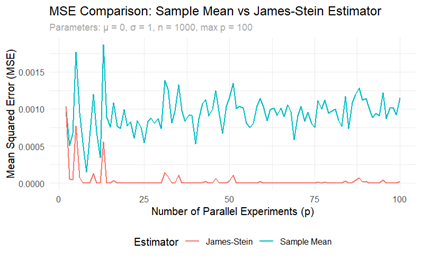   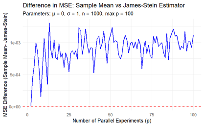

#### Case 2
* Mean MSE difference: -8.591589e-07 
* Max MSE differnce: 4.128701e-05 
* Min MSE difference: 0 
* Last difference: 0.001122277

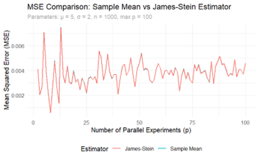   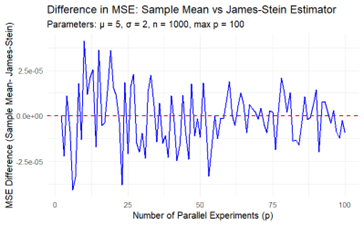

#### Case 3
* Mean MSE difference: 6.447245e-05 
* Max MSE differnce: 0.001397206
* Min MSE difference: 0 
* Last difference: 0.0001294619
* 
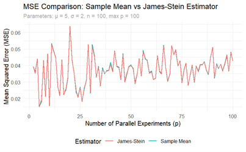   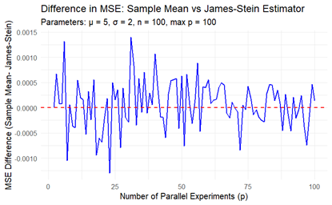

#### Case 5
* Mean MSE difference: 8.106573e-07
* Max MSE differnce: 4.128701e-05
* Min MSE difference: -4.083464e-05
* Last difference: -1.374978e-06

   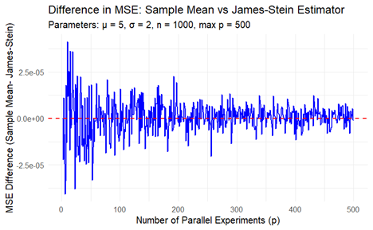

#### Case 5
* Mean MSE difference: 0.08085813
* Max MSE differnce: 0.3426258
* Min MSE difference: -0.2565541 
* Last difference: 0.208852

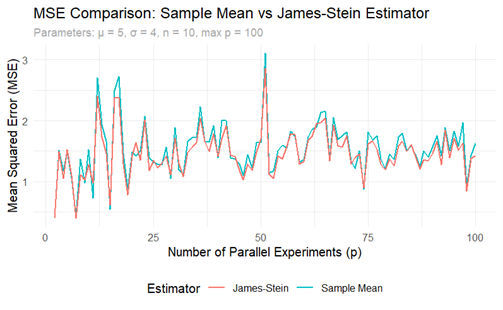   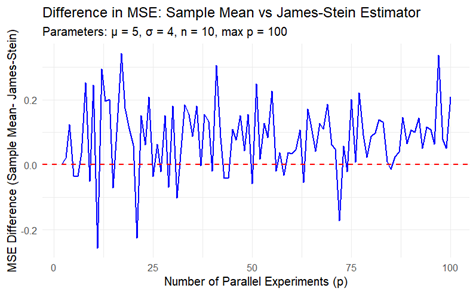

#### Case 6
* Mean MSE difference: 1.12972e-05
* Max MSE differnce: 0.0003323608
* Min MSE difference: -0.0003273479 
* Last difference: -5.718834e-06

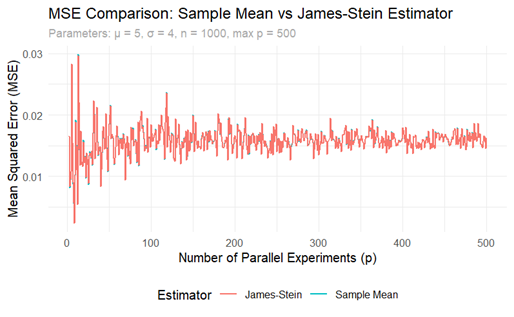   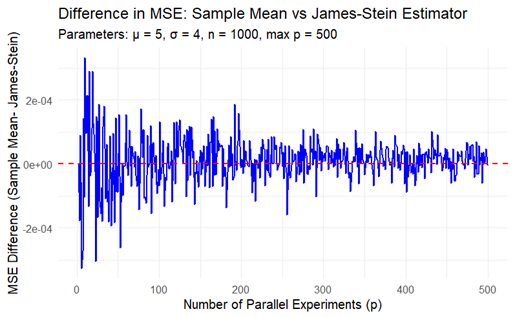

### Key Findings

1. **Sample Size Impact (n)**
   - As the sample size increases, the MSE difference between the sample mean and the James-Stein estimator diminishes.
   - Larger samples improve the reliability of the sample mean, causing the James-Stein estimator’s shrinkage factor (c) to approach 1, reducing its impact.

2. **Number of Parallel Experiments (p)**
   - James-Stein advantage evident for $p > 3$
   - Shrinkage factor decreases with increasing $p$

3. **True Mean (μ) and Standard Deviation ($\sigma^{2}/n$)**
   - Performance consistent across mean variations
   - Higher variance amplifies MSE differences

* The advantage of the James-Stein estimator emerges clearly when p > 3.
* The shrinkage effect provides more stable estimates across multiple experiments.
* The relative improvement in MSE varies with the number of parallel experiments.
* The maximum improvement occurs at intermediate values of p.

## Conclusion

The analysis demonstrates the practical value of Stein's paradox in educational research, providing a more efficient method to estimate treatment effects across parallel experiments.

## Requirements

- R
- ggplot2 library
- Basic statistical computing environment

## Usage

1. Clone the repository
2. Open the R Markdown file
3. Run the simulation with desired parameters

## Author

Giacomo Negri
